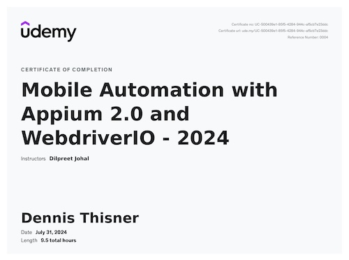
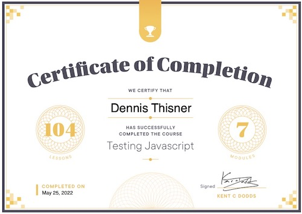
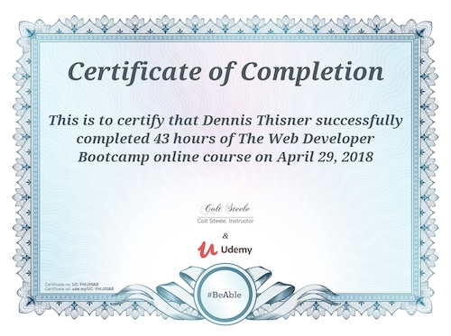
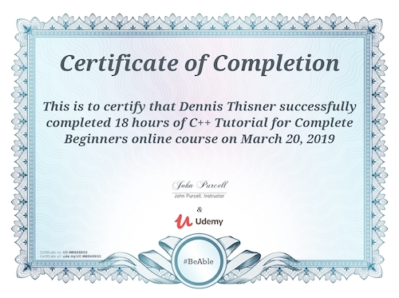
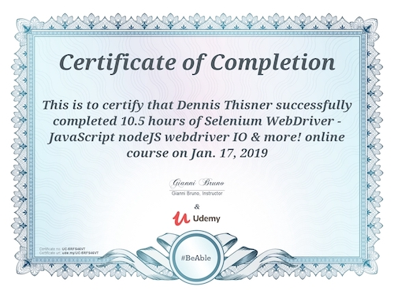
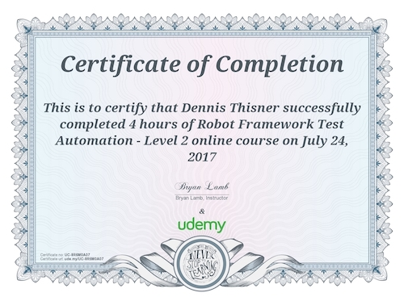
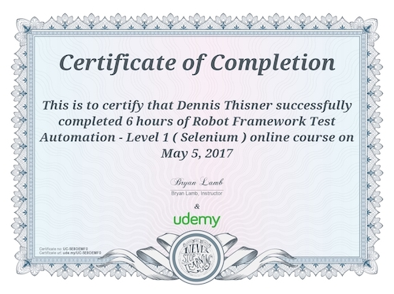
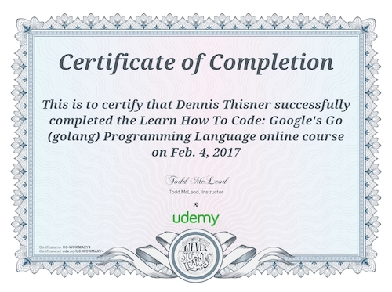
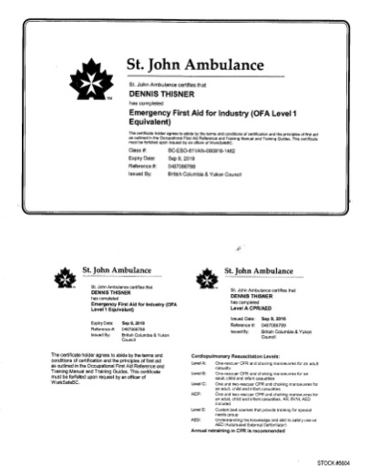

# Certificates
## Mobile Automation with Appium 2.0 and WebdriverIO - July 2024

[Mobile Automation with Appium 2.0 and WebdriverIO](https://www.udemy.com/course/appium-webdriverio-mobile-automation/) with Dilpreet Johal

## Testing Javascript - May 2022

[Testing Javascript](https://testingjavascript.com/) with Kent C. Dodds

## Modern React with Redux - March 2021

[Modern React with Redux](https://www.udemy.com/course/the-complete-react-js-redux-course-build-modern-web-apps/) with Rayan Slim

## The Complete React Js & Redux Course - August 2020

[The Complete React Js & Redux Course - Build Modern Web Apps](https://www.udemy.com/course/the-complete-react-js-redux-course-build-modern-web-apps) with Rayan Slim

## The Web Developer Bootcamp - April 2019

[The Web Developer Bootcamp](https://www.udemy.com/course/the-web-developer-bootcamp) with Colt Steele

## C++ Tutorial for Complete Beginners - March 2019

[C++ Tutorial for Complete Beginners](https://www.udemy.com/course/free-learn-c-tutorial-beginners/) with John Purcell

## Selenium WebdriverIO - January 2019

Selenium WebdriverIO

## Robot Framework Level 2 - July 2017

[Robot Framework Level 2](https://www.udemy.com/course/robot-framework-2/) with Bryan Lamb

## Robot Framework Level 1 - May 2017

[Robot Framework Level 1](https://www.udemy.com/course/robot-framework-1/) with Bryan Lamb

## Golang - February 2017

[Learn How To Code: Google's Go (golang) Programming Language](https://www.udemy.com/course/robot-framework-1/) with Todd McLeod

## First Aid - September 2016

First Aid at St. John Ambulance

