# Certificates

## Gen AI for QA: Playwright, Copilot & Claude Code - August 2026

[Gen AI for QA: Playwright, Copilot & Claude Code](https://www.udemy.com/course/generative-ai-test-automation/) with Alex Dan

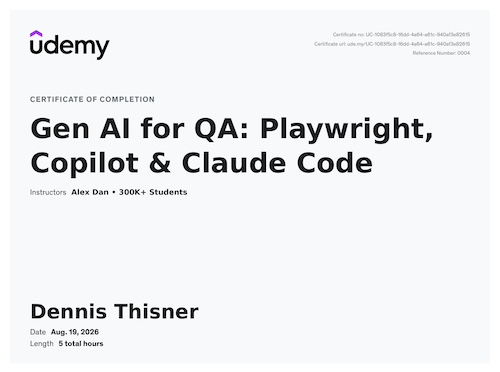

This training focuses on applying Generative AI and prompt engineering to modern QA automation workflows, from generating test plans, test cases, test data, and bug reports to supporting test execution and reporting. It covers building complete Playwright and Selenium test projects with GitHub Copilot, creating AI agents, and integrating MCP servers such as Playwright MCP, Chrome DevTools MCP, and AWS Documentation MCP to give agents access to real testing tools and resources. It also explores running private local LLMs with Ollama inside GitHub Copilot and Claude Code, configuring reusable prompt patterns, and using AI throughout the full software testing lifecycle to make QA automation faster, more consistent, and more scalable.

## React 18 Course 2024 - Learn React JS the fast way - October 2024

[React 18 Course 2024 - Learn React JS the fast way](https://www.udemy.com/course/master-react/) with Jannick Leismann

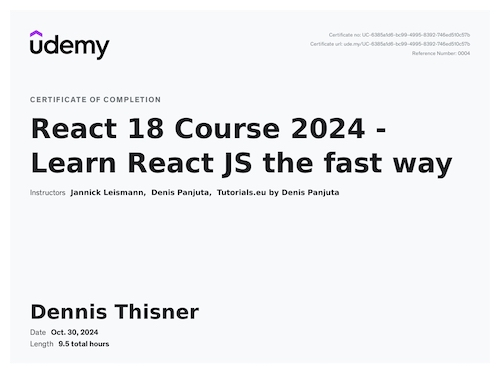

This training provides an intensive introduction to React, focusing on building complete, maintainable web applications such as a modern video platform. It covers working with data, reusable React components, routing, state management, and reducers for scalable application architecture, as well as consuming RESTful APIs with Axios. The course also introduces unit testing with Vitest, JWT-based authentication and user management, and storing user information in databases, giving learners practical experience with both frontend development and the supporting application functionality needed to build production-ready React applications.

## Mobile Automation with Appium 2.0 and WebdriverIO - July 2024

[Mobile Automation with Appium 2.0 and WebdriverIO](https://www.udemy.com/course/appium-webdriverio-mobile-automation/) with Dilpreet Johal

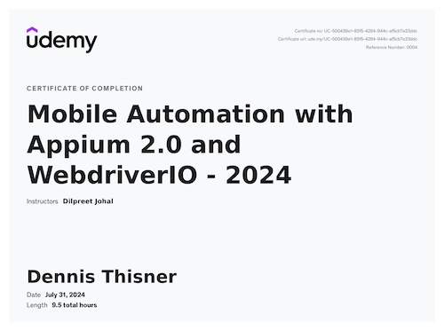

This training focuses on mobile test automation using JavaScript, WebdriverIO, and Appium for both Android and iOS applications. It covers building and optimizing a scalable mobile automation framework, integrating cloud-based testing through BrowserStack, and setting up continuous integration with GitHub Actions. The course provides practical experience in creating reliable, maintainable automated mobile tests and incorporating them into modern CI workflows.

## Testing Javascript - May 2022

[Testing Javascript](https://testingjavascript.com/) with Kent C. Dodds

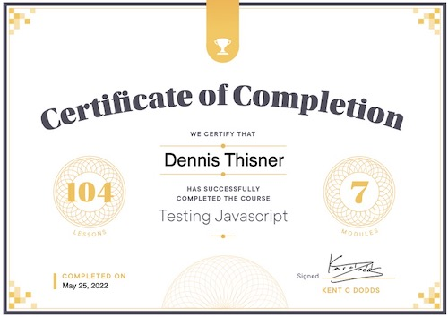

Completed the Testing JavaScript course by Kent C. Dodds, developing practical skills in writing maintainable and reliable automated tests for JavaScript applications. Covered unit and integration testing with Jest, component testing with React Testing Library, end-to-end testing with Cypress, mocking and test doubles, static analysis using tools such as ESLint and TypeScript, test-driven development, code coverage, and effective testing strategies. Gained a strong understanding of how to structure tests around user behaviour and critical application functionality to improve software quality, maintainability, and confidence when shipping changes.

## Modern React with Redux - March 2021

[Modern React with Redux](https://www.udemy.com/course/the-complete-react-js-redux-course-build-modern-web-apps/) with Rayan Slim

Completed The Complete React JS & Redux Course, developing practical experience building modern single-page web applications with React and Redux. Built a full Instagram-style photo-sharing application using reusable React components, JSX, props, state management, React Router, and responsive UI development. Gained hands-on experience with Redux for predictable global state management, actions and reducers, Redux DevTools, and asynchronous data handling with Redux Thunk. Integrated Firebase as a real-time NoSQL database to persist application data, including posts and comments, and developed features such as navigation, adding and removing content, and commenting.

## The Complete React Js & Redux Course - August 2020

[The Complete React Js & Redux Course - Build Modern Web Apps](https://www.udemy.com/course/the-complete-react-js-redux-course-build-modern-web-apps) with Rayan Slim

Completed The Complete React JS & Redux Course, gaining hands-on experience building modern single-page web applications with React and Redux. Developed an Instagram-style photo-sharing application using reusable React components, JSX, props, state management, React Router, and responsive UI development. Worked with Redux to implement centralized application state using stores, actions, reducers, and Redux DevTools, including features for managing posts and comments. Integrated Firebase as a real-time NoSQL database and used asynchronous Redux actions to persist, retrieve, update, and remove application data. The course provided practical experience in structuring React applications, managing complex application state, implementing client-side navigation, and debugging interactive web applications.

## The Web Developer Bootcamp - April 2019

[The Web Developer Bootcamp](https://www.udemy.com/course/the-web-developer-bootcamp) with Colt Steele

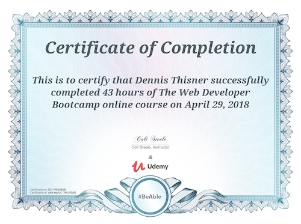

Completed The Web Developer Bootcamp by Colt Steele, gaining hands-on experience across the full web development stack. Developed responsive and accessible web interfaces using HTML5, CSS3, JavaScript, Bootstrap, and modern JavaScript features, before progressing to full-stack development with Node.js, Express, MongoDB, and Mongoose. Built RESTful web applications with database relationships, authentication and authorization, sessions, form validation, and secure user interactions, while working with APIs, AJAX, npm, Git, and command-line tools. Also gained practical experience with React, deployment, cloud databases, image storage, and common web security concerns such as SQL injection and XSS through multiple real-world projects.

## C++ Tutorial for Complete Beginners - March 2019

[C++ Tutorial for Complete Beginners](https://www.udemy.com/course/free-learn-c-tutorial-beginners/) with John Purcell

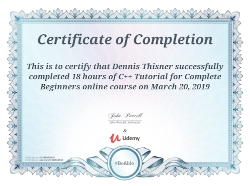

Completed C++ Tutorial for Complete Beginners, gaining a solid foundation in C++ programming and object-oriented programming concepts. Covered core language fundamentals including variables and data types, input/output, operators, conditional statements, loops, functions, arrays, pointers, structures, classes, and file handling. Developed practical experience writing and executing C++ programs while building an understanding of program flow, memory management, and fundamental programming principles.
## Selenium WebdriverIO - January 2019

Selenium WebdriverIO

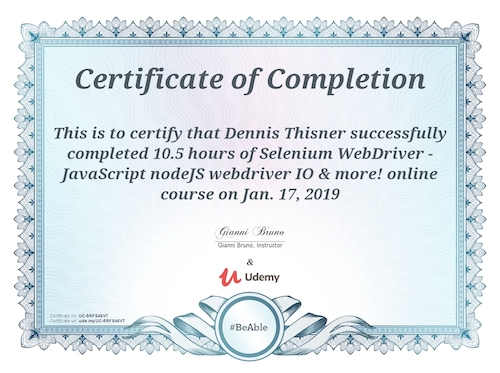

## Robot Framework Level 2 - July 2017

[Robot Framework Level 2](https://www.udemy.com/course/robot-framework-2/) with Bryan Lamb

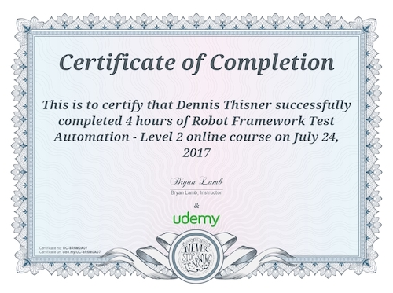

Completed Robot Framework Test Automation – Level 2, developing intermediate to advanced skills in building maintainable and scalable automated test suites with Robot Framework. Gained practical experience with advanced web element locators, conditional logic, loops, dictionaries, JavaScript execution, command-line test execution, and data-driven testing. Learned to create custom Robot Framework libraries to extend the framework’s functionality and applied these techniques in end-to-end automation scenarios involving complex web applications. The course strengthened my ability to structure, maintain, and execute robust automated tests for enterprise-level applications.

## Robot Framework Level 1 - May 2017

[Robot Framework Level 1](https://www.udemy.com/course/robot-framework-1/) with Bryan Lamb

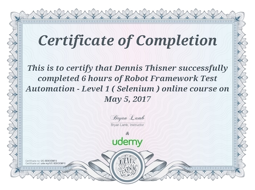

Completed Robot Framework Test Automation – Level 1, gaining practical experience in building automated tests with Robot Framework and Selenium WebDriver. Learned to create, structure, and execute automated web tests using reusable user-defined keywords, variables, resource files, and the Page Object pattern to improve maintainability and readability. Gained hands-on experience with browser automation, element locators, test setup and teardown, test data management, and running test suites through command line, batch files, Jenkins, and scheduled tasks. Also developed an understanding of Robot Framework libraries for Selenium, APIs, databases, XML, and file-based testing.

## Golang - February 2017

[Learn How To Code: Google's Go (golang) Programming Language](https://www.udemy.com/course/robot-framework-1/) with Todd McLeod

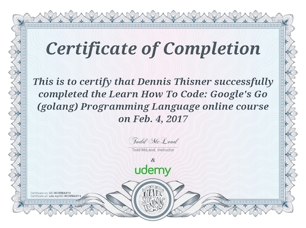

## First Aid - September 2016

First Aid at St. John Ambulance

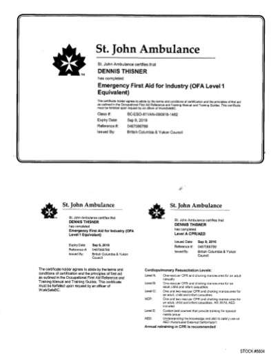
